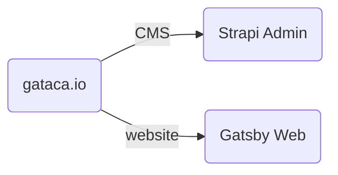

# GATACA Website

# Folders structure

- **Admin**: this is the Strapi CMS project folder. Usually it will not be necessary to change the content in this folder since the content that is edited in the CMS will be pushed to a collection of APIs, without the need to create commits in the repository itself.

- **Web**: this is the Web project folder. This will be where the frontend of the application is developed. The APIs mentioned above will be called to get the content of the web and the views will be created or edited.

# Quick Setup

- **Admin**: Inside the root folder, run the following command to run the project in our local:

  - `yarn install`
  - `yarn develop`

  To manage your project, go to the administration panel at: http://localhost:1337/admin
  To access the server, go to: http://localhost:1337

- **Web**: Inside the root folder, with the admin running, run the following command to run the project in our local:

  - `nvm use 18` since one of the dependencies need node of a version equal to or later than 18.
  - `yarn install`
  - `yarn develop`

  To view the web in the browser, go to http://localhost:8000/

## Plugins
